# soal-shift-sisop-modul-3-IT10-2021
## Anggota Kelompok
- Naufal Aprilian Marsa Mahendra    05311940000007
- Dian Arofati Nur Zamzamy          05311940000011
- Christopher Benedict              05311840000024

# Table Of Content
- [Soal 1](#soal-1)
    + [Deskripsi](#deskripsi)
  * [Soal 1.a](#soal-1a)
    + [Deskripsi](#deskripsi-1)
    + [Penyelesaian](#penyelesaian)
  * [Soal 1.b](#soal-1b)
    + [Deskripsi](#deskripsi-2)
    + [Penyelesaian](#penyelesaian-1)
  * [Soal 1.c](#soal-1c)
    + [Deskripsi](#deskripsi-3)
    + [Penyelesaian](#penyelesaian-2)
  * [Soal 1.d](#soal-1d)
    + [Deskripsi](#deskripsi-4)
    + [Penyelesaian](#penyelesaian-3)
  * [Soal 1.e](#soal-1e)
    + [Deskripsi](#deskripsi-5)
    + [Penyelesaian](#penyelesaian-4)
  * [Soal 1.f](#soal-1f)
    + [Deskripsi](#deskripsi-6)
    + [Penyelesaian](#penyelesaian-5)
  * [Soal 1.g](#soal-1g)
    + [Deskripsi](#deskripsi-7)
    + [Penyelesaian](#penyelesaian-6)
  * [Soal 1.h](#soal-1h)
    + [Deskripsi](#deskripsi-8)
    + [Penyelesaian](#penyelesaian-7)
  * [Kendala](#kendala)
  * [Screenshot](#screenshot)
- [Soal 2](#soal-2)
    + [Deskripsi](#deskripsi-9)
  * [Soal 2.a](#soal-2a)
    + [Deskripsi](#deskripsi-10)
    + [Penyelesaian](#penyelesaian-8)
  * [Soal 2.b](#soal-2b)
    + [Deskripsi](#deskripsi-11)
    + [Penyelesaian](#penyelesaian-9)
  * [Soal 2.c](#soal-2c)
    + [Deskripsi](#deskripsi-12)
    + [Penyelesaian](#penyelesaian-10)
  * [Kendala](#kendala-1)
  * [Screenshot](#screenshot-1)
- [Soal 3](#soal-3)
    + [Deskripsi](#deskripsi-13)
  * [Soal 3.a](#soal-3a)
    + [Deskripsi](#deskripsi-14)
    + [Penyelesaian](#penyelesaian-11)
  * [Soal 3.b](#soal-3b)
    + [Deskripsi](#deskripsi-15)
    + [Penyelesaian](#penyelesaian-12)
  * [Soal 3.c](#soal-3c)
    + [Deskripsi](#deskripsi-16)
    + [Penyelesaian](#penyelesaian-13)
  * [Soal 3.d](#soal-3d)
    + [Deskripsi](#deskripsi-17)
    + [Penyelesaian](#penyelesaian-14)
  * [Soal 3.e](#soal-3e)
    + [Deskripsi](#deskripsi-18)
    + [Penyelesaian](#penyelesaian-15)
  * [Kendala](#kendala-2)
  * [Screenshot](#screenshot-2)

# Soal 1
### Deskripsi
Keverk adalah orang yang cukup ambisius dan terkenal di angkatannya. Sebelum dia menjadi ketua departemen di HMTC, dia pernah mengerjakan suatu proyek dimana keverk tersebut meminta untuk membuat server database buku. Proyek ini diminta agar dapat digunakan oleh pemilik aplikasi dan diharapkan bantuannya dari pengguna aplikasi ini. 

## Soal 1.a
### Deskripsi
Pada saat client tersambung dengan server, terdapat dua pilihan pertama, yaitu register dan login. Jika memilih register, client akan diminta input id dan passwordnya untuk dikirimkan ke server. User juga dapat melakukan login. Login berhasil jika id dan password yang dikirim dari aplikasi client sesuai dengan list akun yang ada didalam aplikasi server. Sistem ini juga dapat menerima multi-connections. Koneksi terhitung ketika aplikasi client tersambung dengan server. Jika terdapat 2 koneksi atau lebih maka harus menunggu sampai client pertama keluar untuk bisa melakukan login dan mengakses aplikasinya. Keverk menginginkan lokasi penyimpanan id dan password pada file bernama akun.txt dengan format :

#### akun.txt
id:password 

id2:password2

### Penyelesaian

pada server side kami melakukan listeting socket pada TCP stream. Kita menggunakan ```while``` ketika melakukan accept koneksi.
### Server Side
```
if ((new_socket = accept(server_fd, (strucsockaddr *)&address, (socklen_t *)&addrlen)) < 0)
{
    exit(EXIT_FAILURE);
}
```
Setelah itu Server akan membuat file akun.txt, membuat folder FILES yang didalamnya terdapat database buku yaitu files.tsv dengan memanggil fungsi ```createFolderFile()```
### Server Side
```
void createFolderFile()
{
    mkdir("FILES", 0777);
    FILE *fp;
    fp = fopen("files.tsv", "a+");
    fclose(fp);

    FILE *fptr;
    fptr = fopen("akun.txt", "a+");

    fclose(fptr);
}
```
Setelah itu Server akan mengirimkan pesan ke user untuk memilih mode terdapat r untuk reghister, l untuk login, dan q untuk quit. Setelah itu client akan mengirimkan mode tersebut untuk ditangkap oleh server dengan ```read()```
### Server Side
```
char *pesan = "\nServer : Masukkan Mode: Login -> l , Register -> r , Quit -> q: ";
send(new_socket, pesan, strlen(pesan), 0);
char mode[1024] = {0};
read(new_socket, mode, 1024);
```
### Client Side
```
char pesan[1024] = {0};
read(sock, pesan, 1024);
printf("%s\n", pesan);
memset(pesan, 0, 1024);
// input mode
char mode[1024] = {0};
fgets(mode, 1024, stdin);
send(sock, mode, strlen(mode), 0);
```
Jika User memilih untuk register maka akan meminta client untuk memasukkan id:password yang akan diproses pada server yaitu dengan memanggil fungsi ```registerAkun(kredensial, password);``` untuk menambahkan kredensial pada database files.tsv
### Server Side
```
memset(mode, 0, 1024);
// Id
char *message = "[Register]Id: ";
send(new_socket, message, strlen(message, 0);
char kredensial[1024] = {0};
read(new_socket, kredensial, 1024);
kredensial[strcspn(kredensial, "\n")] =0;
// Password
message = "[Register]Password: ";
send(new_socket, message, strlen(message, 0);
char password[1024] = {0};
read(new_socket, password, 1024);
password[strcspn(password, "\n")] = 0;
registerAkun(kredensial, password);
memset(kredensial, 0, 1024);
memset(password, 0, 1024);
```
```
void registerAkun(char *kredensial, char *password)
{

    FILE *fptr;
    fptr = fopen("akun.txt", "a+");
    if (fptr == NULL)
    {
      perror("[-]Error in reading file.");
        exit(1);  
    }
    fprintf(fptr, "%s:%s\n", kredensial, password);
    fclose(fptr);
}
```
### Client Side
```
// pesan dari server
char pesan[1024] = {0};
read(sock, pesan, 1024);
printf("%s\n", pesan);
memset(pesan, 0, 1024);
// Masukkan kredensial
char username[1024] = {0};
fgets(username, 1024, stdin);
// kirim kredensial
send(sock, username, strlen(username), 0);
memset(username, 0, 1024);

// pesan dari server
char pesan2[1024] = {0};
read(sock, pesan2, 1024);
printf("%s\n", pesan2);
memset(pesan2, 0, 1024);
// Masukkan kredensial
char password[1024] = {0};
fgets(password, 1024, stdin);
// kirim kredensial
send(sock, password, strlen(password), 0);
memset(password, 0, 1024);
```
Ketika user memilih login maka pada server side akan menerima kredensial yang dikirimkan client. Setelah itu server side akan memanggil fungsi ```checkLogin()``` dengan membuka akun.txt dengan fopen setelah itu menccokkan kredensial ke database tersebut dengan menggunakan strcmp dengan membaca line ke line.
### Server Side
```
int checkLogin(char *kredensial, char *password)
{
    FILE *fptr;

    fptr = fopen("akun.txt", "r+");
    if (fptr == NULL)
    {
        perror("[-]Error in reading file.");
        exit(1);
    }
    char line[256];
    char user[1024] = {0};
    sprintf(user, "%s:%s", kredensial, password);
    while (fgets(line, sizeof(line) - 1, fptr))
    {
        if (strcmp(user, line) == 0)
        {
            strcpy(cookie, user);
            return 1;
        }
    }
    fclose(fptr);
    return 0;
}
```

## Soal 1.b
### Deskripsi
Sistem memiliki sebuah database yang bernama files.tsv. Isi dari files.tsv ini adalah path file saat berada di server, publisher, dan tahun publikasi. Setiap penambahan dan penghapusan file pada folder file yang bernama  FILES pada server akan memengaruhi isi dari files.tsv. Folder FILES otomatis dibuat saat server dijalankan. 
### Penyelesaian
ini Penyelesaiannya sudah terdapat pada soal 1 a dengan memanggil fungsi ```createFolderFile()```

## Soal 1.c
### Deskripsi
Tidak hanya itu, Keverk juga diminta membuat fitur agar client dapat menambah file baru ke dalam server. Direktori FILES memiliki struktur direktori di bawah ini : 

Direktori FILES 

```
File1.ekstensi

File2.ekstensi
```
Pertama client mengirimkan input ke server dengan struktur sebagai berikut :
Contoh Command Client :
```
add
```
Output Client Console:
```
Publisher:
Tahun Publikasi:
Filepath
```
Kemudian, dari aplikasi client akan dimasukan data buku tersebut (perlu diingat bahwa Filepath ini merupakan path file yang akan dikirim ke server). Lalu client nanti akan melakukan pengiriman file ke aplikasi server dengan menggunakan socket. Ketika file diterima di server, maka row dari files.tsv akan bertambah sesuai dengan data terbaru yang ditambahkan.

### Penyelesaian
Penyelesaiannya adalah server akan mengirimkan pesan ke client supaya memasukkan publisher, tahun publikasi, dan filepath yang akan dikirimkan ke server.
### Server Side
```
if (strcmp(buffer2, "add\n") == 0)
{
    memset(buffer2, 0, 1024);
    // publisher
    char *message = "Publisher: ";
    send(new_socket, message, strlen(message), 0);
    char publisher[1024] = {0};
    read(new_socket, publisher, 1024);

    publisher[strcspn(publisher, "\n")] = 0;
    // tahun publikasi

    message = "Tahun Publikasi: ";
    send(new_socket, message, strlen(message), 0);
    char tahun_publikasi[1024] = {0};
    read(new_socket, tahun_publikasi, 1024);
    tahun_publikasi[strcspn(tahun_publikasi, "\n")] = 0;
    // Filepath
    message = "Filepath: ";
    send(new_socket, message, strlen(message), 0);
    char temp[1024] = {0};
    char filenamepath[1024] = {0};
    char *temp2[100];
    char *slash;
    int x;
    read(new_socket, temp, 1024);
    slash = strtok(temp, "/");
    while (slash != NULL)
    {
        temp2[x] = slash;
        x++;
        slash = strtok(NULL, "/");
    }
    strcpy(filenamepath, temp2[x - 1]);
    memset(temp, 0, 1024);

    addtoDatabase(new_socket, publisher, tahun_publikasi, filenamepath);
}
```
### client Side
```
if (strcmp(buffer2, "add\n") == 0)
{

    memset(buffer2, 0, 1024);
    // publisher
    read(sock, buffer2, 1024);
    printf("%s", buffer2);
    memset(buffer2, 0, 1024);
    fgets(buffer2, 1024, stdin);
    send(sock, buffer2, strlen(buffer2), 0);
    memset(buffer2, 0, 1024);
    // tahun publikasi
    read(sock, buffer2, 1024);
    printf("%s", buffer2);
    memset(buffer2, 0, 1024);
    fgets(buffer2, 1024, stdin);
    send(sock, buffer2, strlen(buffer2), 0);
    memset(buffer2, 0, 1024);
    // filepath
    read(sock, buffer2, 1024);
    printf("%s", buffer2);
    memset(buffer2, 0, 1024);
    char filenamepath[1024] = {0};

    fgets(buffer2, 1024, stdin);
    strcpy(filenamepath, buffer2);
    memset(buffer2, 0, 1024);
    strtok(filenamepath, "\n");
    send(sock, filenamepath, strlen(filenamepath), 0);

}
```
Server juga akan menerima file yang dikirimkan oleh client dengan memanggil fungsi ```addtoDatabase()```. Jika berhasil maka akan membuka database files.tsv dengan menggunakan fopen dan melakukan write dengan mode append. Disini ketika berhasil juga memembuka file yang bernama running.log untuk menambahkan logging siapa yang sedang menambahkan file tersebut dengan format
```
Tambah : File1.ektensi (id:pass)
```
### Server Side
```
void addtoDatabase(int new_socket, char *publisher, char *tahun_publikasi, char *filenamepath)
{

    char tmp[1024] = {0};
    strcpy(tmp, "FILES/");
    strcat(tmp, filenamepath);
    
    char file_length[1024] = {0}, buffer[1024] = {0}, file_content[1024] = {0};
    memset(buffer, 0, sizeof(buffer));
    long fsize;

    // recieve checkfile
    char check[2] = {0};
    read(new_socket, check, 2);
    int checkyuk = atoi(check);
    if (checkyuk)
    {
        // recieve file size

        int valread = read(new_socket, file_length, 1024);
        if (valread < 1)
        {
            char *errorpesan = "error gan";
        }
        fsize = strtol(file_length, NULL, 0);
        memset(file_length, 0, sizeof(file_length));

        // recieve file content
        int i = 0;
        while (i < fsize)
        {
            int valread = read(new_socket, buffer, 1024);
            if (valread < 1)
            {
                char *errorpesan = "error gan";
            }
            strcat(file_content, buffer);
            memset(buffer, 0, sizeof(buffer));
            i += 1024;
        }

        memset(buffer, 0, sizeof(buffer));
        FILE *fpr;
        fpr = fopen(tmp, "w");
        fprintf(fpr, "%s", file_content);
        memset(file_content, 0, sizeof(file_content));
        fclose(fpr);
        

        FILE *fp;
        fp = fopen("files.tsv", "a+");
        fprintf(fp, "%s\t%s\t%s\n", publisher, tahun_publikasi, tmp);
        fclose(fp);
        char message[30] = "Tambah: ";
        strcat(message, filenamepath);
        runningLog(message);

        char *berhasil = "Berhasil ditambahkan";
        send(new_socket, berhasil, strlen(berhasil), 0);
    }
    else
    {
        char *gagal = "Gagal ditambahkan";
        send(new_socket, gagal, strlen(gagal), 0);
    }
}
```

### client Side

```
    FILE *fp;
    fp = fopen(filenamepath, "r");
    char file_length[1024] = {0};
    char file_content[1024] = {0};
    if (fp == NULL)
    {
        //send confirmation

        char *check = "0";
        send(sock, check, strlen(check), 0);
        printf("[-]Error in reading file.\n");
    }
    else
    {
        fseek(fp, 0, SEEK_END);
        int fsize = ftell(fp);
        rewind(fp);
        fread(file_content, 1, fsize, fp);
        fclose(fp);

        //send confirmation
        char *check = "1";
        send(sock, check, strlen(check), 0);

        // send file size
        sprintf(file_length, "%d", fsize);
        send(sock, file_length, sizeof(file_length), 0);
        sleep(1);

        // send file content

        sendFile(sock, fsize, file_content);
    }
```

## Soal 1.d
### Deskripsi
Dan client dapat mendownload file yang telah ada dalam folder FILES di server, sehingga sistem harus dapat mengirim file ke client. Server harus melihat dari files.tsv untuk melakukan pengecekan apakah file tersebut valid. Jika tidak valid, maka mengirimkan pesan error balik ke client. Jika berhasil, file akan dikirim dan akan diterima ke client di folder client tersebut. 

Contoh Command client
```
download TEMPfile.pdf
```
### Penyelesaian
Disini Server akan mengirimkan pesan kepada client untuk memasukkan nama file yang akan di download yang ada pada database server. Client akan mengirimkan nama filenya. Setelah itu server akan mengirimkan file yang diinginkan oleh user jika ada di database

### Server Side
```
else if (strcmp(buffer2, "download\== 0)
{
    int filecheck = 0;
    memset(buffer2, 0, 1024);
    readDatabase();
    sendMessage(new_socket, "[APP] File To Download: ");
    char findthisstring[100] = {0};
    // testing
    read(new_socket, findthisstring, 100);
    strtok(findthisstring, "\n");
   
    filecheck = checkDownloadfile(new_socket, findthisstring);

    char isfileready[2];
    sprintf(isfileready, "%d", filecheck);
    // kirim otentikasi
    send(new_socket, isfileready, strlen(isfileready), 0);
    memset(isfileready, 0, 2);
    if (filecheck)
    {
        char file_content[1024] = {0};

        char file_length[1024] = {0};
        FILE *fp;
        char pathfile[100] = "FILES/";
        strcat(pathfile, findthisstring);
        memset(findthisstring, 0, 100);
        fp = fopen(pathfile, "r");
        if (fp == NULL)
        {
            perror("[-]Error in reading file.");
            exit(1);
        }

        fseek(fp, 0, SEEK_END);
        int fsize = ftell(fp);
        rewind(fp);

        fread(file_content, 1, fsize, fp);
        fclose(fp);

        // send file size
        sprintf(file_length, "%d", fsize);
        send(new_socket, file_length, sizeof(file_length), 0);
        sleep(1);
        memset(file_length, 0, 100);

        // send file content
        sendFile(new_socket, fsize, file_content);
    }
    else
    {
        char tidak[200] = " Gagal \n";
        send(new_socket, tidak, 200, 0);
    }

    memset(findthisstring, 0, 100);
}
```
### client Side
```
else if (strcmp(buffer2, "download\n") == 0)
{
    readMessage(sock);
    // input string
    char inputString[100] = {0};
    fgets(inputString, 100, stdin);
    inputString[strcspn(inputString, "\n")] = 0;
    send(sock, inputString, strlen(inputString), 0);
    //memset(inputString, 0, 100);
    char file_length[1024] = {0}, buffer[1024] = {0}, file_content[1024] = {0}, isfileready[2];
    read(sock, isfileready, 2);
    int fileready = atoi(isfileready);
    memset(isfileready, 0, 2);
    if (fileready)
    {
        // recieve file size
        read(sock, file_length, 1024);
        long fsize;
        fsize = strtol(file_length, NULL, 0);
        memset(file_length, 0, 1024);
        // recieve file content
        long i = 0;
        while (i < fsize)
        {
            memset(buffer, 0, sizeof(buffer));
            int valread = read(sock, buffer, 1024);
            if (valread < 1)
            {
                char *errorpesan = "error gan";
            }
            strcat(file_content, buffer);
            i += 1024;
        }

        memset(buffer, 0, sizeof(buffer));

        FILE *fp;

        fp = fopen(inputString, "w");
        if (fp == NULL)
        {
            perror("[-]Error in reading file.");
            exit(1);
        }
        fprintf(fp, "%s", file_content);
        memset(file_content, 0, sizeof(file_content));

        fclose(fp);
    }
    else
    {
        char message[200] = {0};
        read(sock, message, 200);
        printf("%s", message);
        memset(message, 0, 200);
    }
}
```
## Soal 1.e
### Deskripsi
Setelah itu, client juga dapat menghapus file yang tersimpan di server. Akan tetapi, Keverk takut file yang dibuang adalah file yang penting, maka file hanya akan diganti namanya menjadi ‘old-NamaFile.ekstensi’. Ketika file telah diubah namanya, maka row dari file tersebut di file.tsv akan terhapus.

Contoh Command Client:
```
delete TEMPfile.pdf
```
### Penyelesaian
Disini Server akan mengirimkan pesan ke client untuk memasukkan nama file yang ingin dihapus yang ada di database files.tsv. Client akan mengirimkan nama file. Server akan menerima dan melihat pada database yang ada file tersebut ada atau tidak. Jika ada maka nama file pada database tersebut akan dihapus dengan memanggil fungsi ```deleteFile()```. Disini kita bisa membanfingkan file dengan yang ada di database dengan ```strcmp()``` dan mengetahui posisi dari file tersebut. Jika ada maka posisi tersebut akan menentukan untuk tidak ditulis ulang ke database menggunakan ```for loop```. Nama file yang akan dihapus akan diganti dengan menggunakan ```rename``` menjadi ```old-file.ext```. Disini juga akan membuka file yang bernama running.log dan menambahkan log dengan format ```Hapus : File2.ektensi (id:pass)``` jika penghapusan berhasil
### Server Side
```
else if (strcmp(buffer2, "delete\n") == 0)
{
    memset(buffer2, 0, 1024);
    readDatabase();
    sendMessage(new_socket, "[APP] File to Delete: ");
    char findthisfile[100] = {0};
    // testing
    read(new_socket, findthisfile, 100);
    deleteFile(new_socket, findthisfile);
    memset(findthisfile, 0, 100);
}
```
```
void deleteFile(int new_socket, char *findthisfile)
{
    
    char see[1024] = {0};
    int i = 0;
    //int pos = 0;
    int checkfile = 0;
    int position = 0;
    for (int i = 0; i < jumlahData; i++)
    {
        if (strcmp(namafull[i], findthisfile) == 0)
        {
            //pos += sprintf(&see[pos], "Nama: %s\nPublisher: %s\nTahun publishing: %s\nEkstensi File : %sFilepath : %s\n", nama[i], publisherbuku[i], tahunpublishbuku[i], ekstensi[i], fullpath[i]);
            checkfile = 1;
            position = i;
        }
    }
    if (checkfile)
    {
        char tmp[100] = "FILES/old-";
        char tmp2[100] = "FILES/";
        strcat(tmp, findthisfile);
        strcat(tmp2, findthisfile);
        // rename file
        rename(tmp2, tmp);

        FILE *fp;
        fp = fopen("files.tsv", "w");

        // tulis ulang database
        for (int i = 0; i < jumlahData; i++)
        {
            if (i == position)
            {
                continue;
            }
            else
            {
                fprintf(fp, "%s\t%s\t%s", publisherbuku[i], tahunpublishbuku[i], fullpath[i]);
            }
        }

        // pesan delete berhasil
        memset(see, 0, 1024);
        char pesan[150] = {0};
        sprintf(pesan, "Hapus : %s", namafull[position]);
        runningLog(pesan);
        fclose(fp);
        char *message = "Berhasil\n";
        send(new_socket, message, strlen(message), 0);
    }
    else
    {
        char *message = "Gagal\n";
        send(new_socket, message, strlen(message), 0);
    }
}
```

### client Side
```
else if (strcmp(buffer2, "delete\n") == 0)
{
    memset(buffer2, 0, 1024);
    readMessage(sock);
    // input string
    char iniinput[100] = {0};
    fgets(iniinput, 100, stdin);
    iniinput[strcspn(iniinput, "\n")] = 0;
    send(sock, iniinput, strlen(iniinput), 0);
    memset(iniinput, 0, 100);
    char delet[10] = {0};
    memset(delet, 0, 10);

    read(sock, delet, 10);
    printf("%s", delet);
    memset(delet, 0, 10);
}
```
## Soal 1.f
### Deskripsi
Client dapat melihat semua isi files.tsv dengan memanggil suatu perintah yang bernama see. Output dari perintah tersebut keluar dengan format. 

Contoh Command Client :
```
see
```
Contoh Format Output pada Client:
```
Nama:
Publisher:
Tahun publishing:
Ekstensi File : 
Filepath : 

Nama:
Publisher:
Tahun publishing:
Ekstensi File : 
Filepath : 

```
### Penyelesaian
Server akan melakukan read database dengan memanggil fungsi ```readDatabase()``` dimana akan fopen files.tsv setelah itu kita lakukan while dan fgets untuk membaca line ke line dan kita lakukan split dengan delimiter ```\t``` dengan strtok dan dimasukkan ke array public. Setelah itu tinggal lakukan for loop dan dikirimkan ke user dengan memanggil seeDatabase().
### Server Side

```
void readDatabase()
{
    char line[50][500] = {0};
    FILE *fp;
    fp = fopen("files.tsv", "r");
    int i = 0;
    jumlahData = 0;
    char *temp = calloc(300, sizeof(char));
    char *temp2 = calloc(300, sizeof(char));

    while (fgets(line[i], sizeof(line), fp))
    {

        char *token = strtok(line[i], "\t");

        sprintf(publisherbuku[i],"%s", token);
        token = strtok(NULL, "\t");
        sprintf(tahunpublishbuku[i], "%s",token);
        token = strtok(NULL, "\t");
        sprintf(fullpath[i],"%s", token);

        sprintf(temp,"%s", fullpath[i]);
        char *token2 = strtok(temp, ".");
        sprintf(temp2,"%s", fullpath[i]);
        token2 = strtok(NULL, ".");
        sprintf(ekstensi[i],"%s", token2);

        char *token3 = strtok(temp, "/");
        token2 = strtok(NULL, "/");
        sprintf(nama[i],"%s", token2);
        strtok(nama[i], "\n");
        strtok(ekstensi[i], "\n");

        sprintf(namafull[i],"%s", nama[i]);
        strcat(namafull[i], ".");
        strcat(namafull[i], ekstensi[i]);
        memset(line[i], 0, 500);
        i++;
        jumlahData++;
    }
    fclose(fp);
}
```
```
void seeDatabase(int new_socket)
{
    char see[1024] = {0};
    int i = 0;
    int pos = 0;

    for (i = 0; i < jumlahData; i++)
    {
        pos += sprintf(&see[pos], "Nama: %s\nPublisher: %s\nTahun publishing: %s\nEkstensi File : %s\nFilepath : %s\n", nama[i], publisherbuku[i], tahunpublishbuku[i], ekstensi[i], fullpath[i]);
    }
    //sprintf(strlen(&see[pos]), "Nama: %s\nPublisher: %s\nTahun publishing: %s\nEkstensi File : %sFilepath : %s\n", nama[i], publisherbuku[i], tahunpublishbuku[i], ekstensi[i], fullpath[i]);

    send(new_socket, see, 1024, 0);
    memset(see, 0, 1024);
}
```
```
else if (strcmp(buffer2, "see\n") == 0)
{
    readDatabase();
    memset(buffer2, 0, 1024);
    seeDatabase(new_socket);
}
```
## Soal 1.g
### Deskripsi
Aplikasi client juga dapat melakukan pencarian dengan memberikan suatu string. Hasilnya adalah semua nama file yang mengandung string tersebut. Format output seperti format output f.

Contoh Client Command:
```
find TEMP
```
### Penyelesaian
Disini Server akan mengirimkan pesan ke client yang berisikan untuk menginputkan string file yang dicari. Setelah itu Server akan mencari ke database string file yang dicari. Pertama akan melakukan readDatabase(). Memasukkan seluruh nama file yang ada di database untuk dimasukkan ke array public. Disini kita tinggal melakukan for loop untuk mencocokkan string dari client sama array dengan melakukan for loop. mengcomparenya menggunakan ```strstr``` lalu jika cocok ditampilkan dengan format yang ada
### Server Side
```
void findstring(int new_socket, char *findthisstring)
{
    
    char *p;
    char see[1024] = {0};
    int i = 0;
    int pos = 0;
    for (int i = 0; i < jumlahData; i++)
    {
        p = strstr(namafull[i], findthisstring);
        if (p)
        {
            pos += sprintf(&see[pos], "Nama: %s\nPublisher: %s\nTahun publishing: %s\nEkstensi File : %s\nFilepath : %s\n", nama[i], publisherbuku[i], tahunpublishbuku[i], ekstensi[i], fullpath[i]);
        }
    }

    send(new_socket, see, 1024, 0);
    memset(see, 0, 1024);
}
```
```
else if (strcmp(buffer2, "find\n") == 0)
{
    memset(buffer2, 0, 1024);
    readDatabase();
    sendMessage(new_socket, "[APP] String: ");
    char findthisstring[100] = {0};
    // testing
    read(new_socket, findthisstring, 100);

    findstring(new_socket, findthisstring);
    memset(findthisstring, 0, 100);
}
```
### Client Side
```
else if (strcmp(buffer2, "find\n") == 0)
{
    memset(buffer2, 0, 1024);
    readMessage(sock);
    // input string
    char inputString[100] = {0};
    fgets(inputString, 100, stdin);
    inputString[strcspn(inputString, "\n")] = 0;
    send(sock, inputString, strlen(inputString), 0);
    memset(inputString, 0, 100);
    char see[1024] = {0};
    memset(see, 0, 1024);
    // Read Database
    read(sock, see, 1024);
    printf("%s", see);
    memset(see, 0, 1024);
}
```

## Soal 1.h
### Deskripsi
Dikarenakan Keverk waspada dengan pertambahan dan penghapusan file di server, maka Keverk membuat suatu log untuk server yang bernama running.log. Contoh isi dari log ini adalah

running.log

```
Tambah : File1.ektensi (id:pass)
Hapus : File2.ektensi (id:pass)
```
### Penyelesaian
Penyelesaiannya terdapat pada soal 1.c dan 1.e
## Kendala
Tidak ada
## Screenshot
Soal 1 Login dan Register

```client```

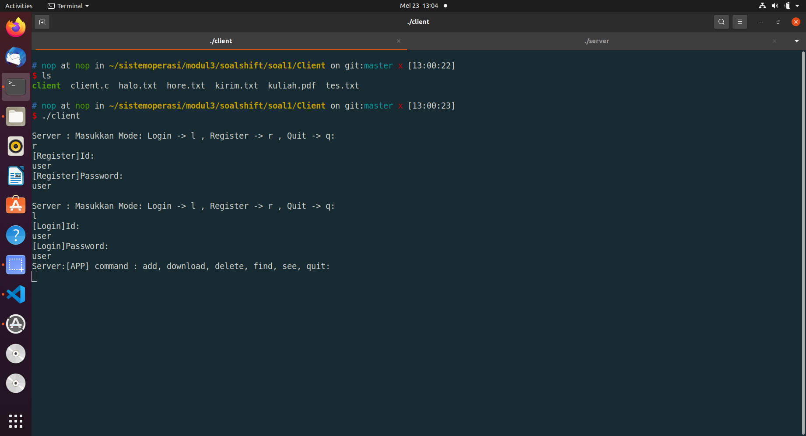

```server```

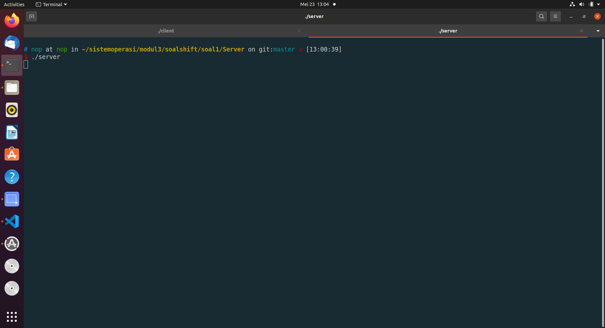

```tree```

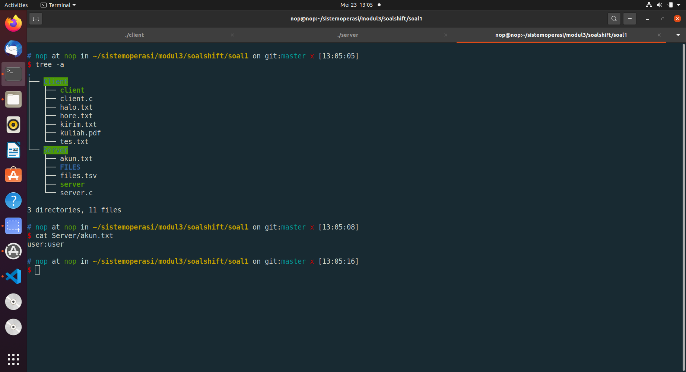

Soal 1 Add

```client```

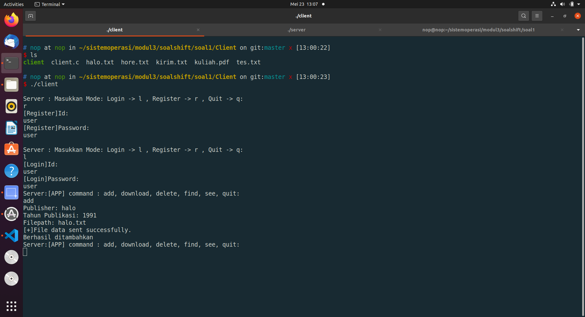

```tree```

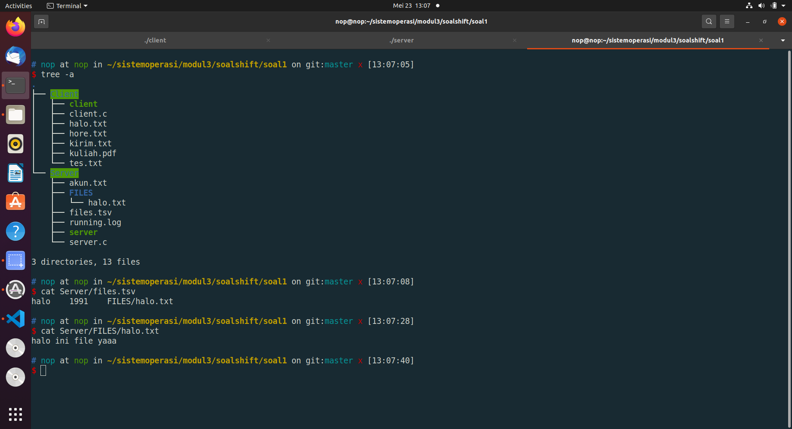

Soal 1 download

```client```

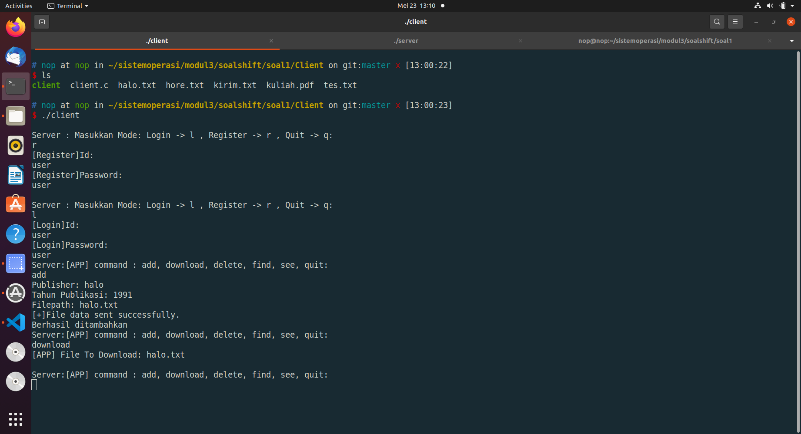


```tree```

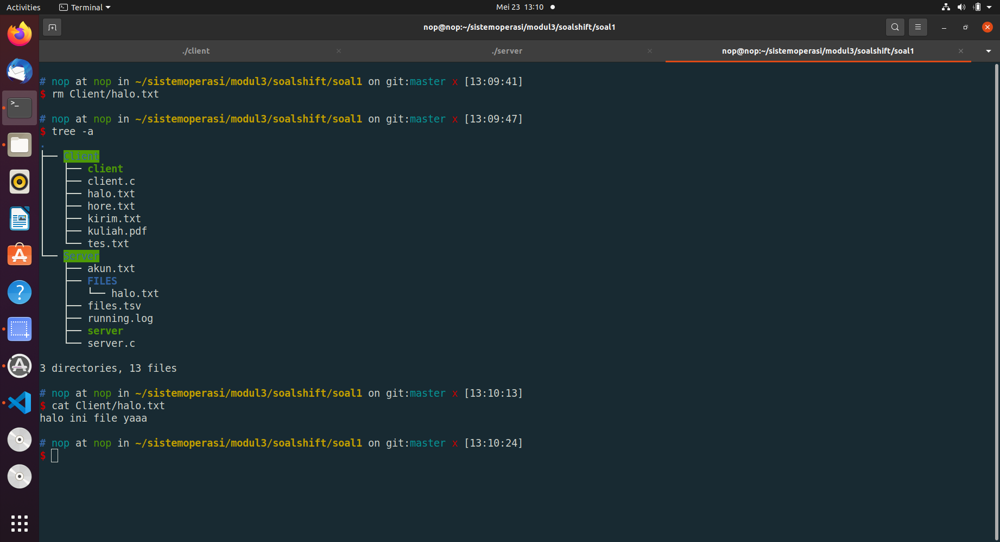

Soal 1 See

```client```

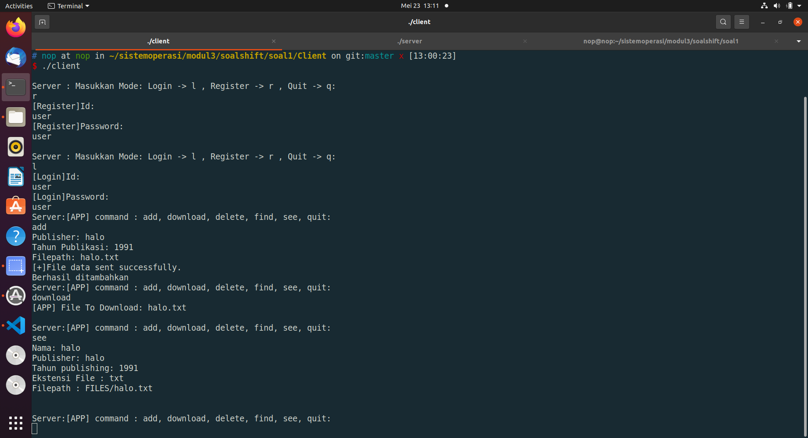

Soal 1 Find

```client```

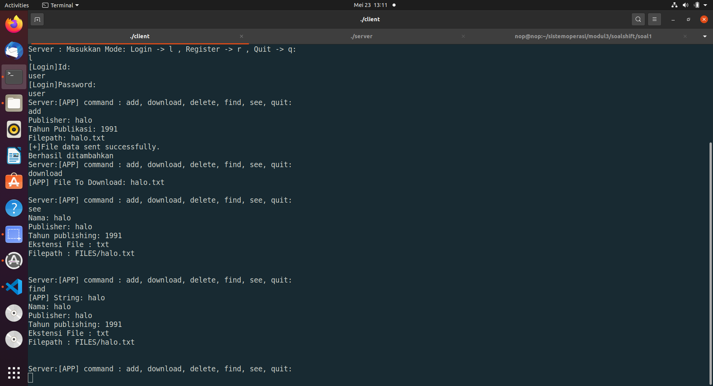

Soal 1 Delete

```client```

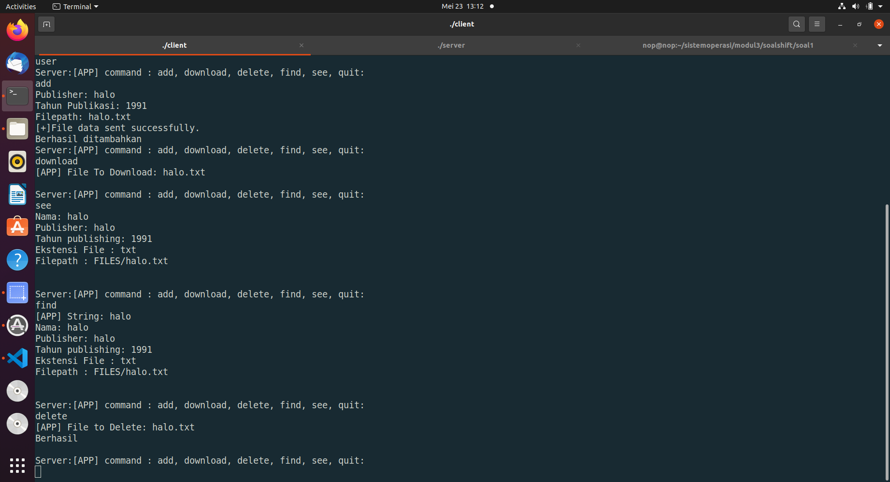

```tree```


Soal 1 running.log

```running.log```

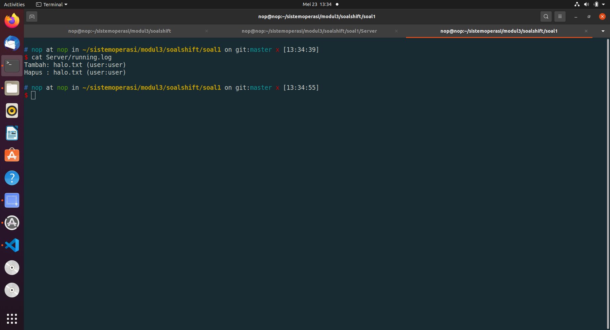

# Soal 2
### Deskripsi
Crypto (kamu) adalah teman Loba. Suatu pagi, Crypto melihat Loba yang sedang kewalahan mengerjakan tugas dari bosnya. Karena Crypto adalah orang yang sangat menyukai tantangan, dia ingin membantu Loba mengerjakan tugasnya. Detil dari tugas tersebut adalah:
## Soal 2.a
### Deskripsi
Membuat program perkalian matrix (4x3 dengan 3x6) dan menampilkan hasilnya. Matriks nantinya akan berisi angka 1-20 (tidak perlu dibuat filter angka).
### Penyelesaian
Pertama, mendefine ukuran matriks1 r1xc1 = 4x3, matriks2 r2xc2 = 3x6, matriks3 hasil perkalian r3xc3 = 4x6
```
unsigned long long int r1 = 4, c1 = 3;
unsigned long long int r2 = 3, c2 = 6;
unsigned long long int r3 = 4, c3 = 6;
```

Pada fungsi main terdapat beberapa fungsi yaitu untuk menginputkan matriks1 dan matriks2, mengalikan kedua matriks yang sudah diinputkan, dan menampilkan hasil perkalian matriks.
Mendefine matriks1 sebagai first[r1][c2], matriks2 sebagai second[r2][c2], dan matriks3 sebagai result[r3][c3]
``` unsigned long long int first[r1][c1], second[r2][c2], result[r3][c3]; ```

Selanjutnya mengambil input user untuk matriks1 atau matriks A, kemudian disimpan sebagai matriks first[r1][c1],
```
   sprintf(prompt, "Matrix ke A\n");
   printf("%s", prompt);
   for (unsigned long long int i = 0; i < r1; ++i)
   {
      for (unsigned long long int j = 0; j < c1; ++j)
      {
         sprintf(prompt2, "Masukkan A %llu %llu ", i + 1, j + 1);
         printf("%s", prompt2);
         scanf("%llu", &first[i][j]);
      }
      printf("\n");
   }
```

Kemudian mengambil input user untuk matriks2 atau matriks B, kemudian disimpan sebagai matriks second[r2][c2]
```
   sprintf(prompt, "Matrix ke B\n");
   printf("%s", prompt);
   for (unsigned long long int i = 0; i < r2; ++i)
   {
      for (unsigned long long int j = 0; j < c2; ++j)
      {
         sprintf(prompt4, "Masukkan B %llu %llu ", i + 1, j + 1);
         printf("%s", prompt4);
         scanf("%llu", &second[i][j]);
      }
      printf("\n");
   }
```

Menghitung perkalian antara matriks A dan matriks B
Inisiasi matriks hasil perkalian sebagai matriks result[r3][c3]
```unsigned long long int i = 0, j = 0;
   while (i < r3)
   {
      j = 0;
      while (j < c3)
      {
         result[i][j] = 0;
         j++;
      }
      i++;
   }
```

Menghitung hasil perkalian antara matriks first[r1][c1] dengan second[r2][c2]
```
   unsigned long long int sum = 0;
   char prompt5[100];unsigned long long int k =0;
   i = 0, j = 0;
   sprintf(prompt5, "\nMenghitung...\n");
   printf("%s", prompt5);
   while (i < r1)
   {
      j = 0;
      while (j < c2)
      {
         k = 0;
         while (k < c1)
         {
            sum += first[i][k] * second[k][j];
            k++;
         }
         result[i][j] = sum;
         sum = 0;
         j++;
      }
      i++;
   }
```

Menampilkan hasil perkalian matriks dengan memanggil fungsi display
```
    char *message = "Hasil";
    display(result, message);
```

Untuk fungsi display adalah sebagai berikut
```
void display(unsigned long long int matrix[r3][c3], char *Messsage)
{

   char prompt[100] = {0};
   sprintf(prompt, "\nOutput Matrix %s\n", Messsage);
   printf("%s", prompt);
   unsigned long long int i = 0, j = 0;
   while (i < r3)
   {
      j = 0;
      while (j < c3)
      {
         printf("%llu  ", matrix[i][j]);
         if (j == c3 - 1)
         {
            printf("\n");
         }
         j++;
      }
      i++;
   }
}
```

Kemudian hasil perkalian matriks disimpan dalam shared memory agar hasil tersebut dapat diakses oleh program lain yaitu program soal2b
Define key(nilai akses yang terkait dengan semaphore Id)
```key_t key = 1337;``` 

untuk mendapatkan id dari shared memory digunakan fungsi ```shmget()``` untuk mendapatkan akses ke shared memory segment dengan argument key, ukuran shared memory yaitu ukuran matriks result, dan argument flag untuk menentukan initial accesss permission(IPC_CREAT | 0666), dan menggunakan fungsi ```shmat()``` untuk meng-attach shared memory segment yang akan mereturn pointer, dan disimpan sebagai variable value.
```
   unsigned long long int *value;
   unsigned long long int shmid = shmget(key, sizeof(result), IPC_CREAT | 0666);
   value = shmat(shmid, NULL, 0);
```

Selanjutnya meng-copy matriks result ke shared memory dengan menggunakan fungsi ```memcpy()```
```
unsigned long long int *p = (unsigned long long int *)value;
memcpy(p, result, 192);
```

kemudian men-detach shared memory segment yang ada pada address value
```shmdt(value);```

## Soal 2.b
### Deskripsi
Membuat program dengan menggunakan matriks output dari program sebelumnya (program soal2a.c) (Catatan!: gunakan shared memory). Kemudian matriks tersebut akan dilakukan perhitungan dengan matrix baru (input user) sebagai berikut contoh perhitungan untuk matriks yang a	da. Perhitungannya adalah setiap cel yang berasal dari matriks A menjadi angka untuk faktorial, lalu cel dari matriks B menjadi batas maksimal faktorialnya matri(dari paling besar ke paling kecil) (Catatan!: gunakan thread untuk perhitungan di setiap cel). 
### Penyelesaian
Mendefine ukuran matriks r3xc3 yaitu 4x6, ukuran yang sama dengan hasil perkalian matriks dari program soal2a.
```unsigned long long int r3 = 4, c3 = 6;```

membuat struct args
```
struct args
{
    unsigned long long int i, j;
};
```

Membuat variable global matriks A, matriks B, dan matriks hasil
```unsigned long long int matrixA[4][6], matrixB[4][6], hasil[4][6];```

Pada fungsi main, mengakses shared memory untuk mendapatkan hasil perkkalian matriks dari program sebelumnya yaitu program soal2a, kemudian matriks dari program sebelumnya disimpan sebagai matrixA
```
    key_t key = 1337;
    unsigned long long int *value;
    unsigned long long int shmid = shmget(key, 96, IPC_CREAT | 0666);
    value = shmat(shmid, NULL, 0);

    unsigned long long int *p = (unsigned long long int *)value;
    memcpy(matrixA, p, 192);

    shmdt(value);
    shmctl(shmid, IPC_RMID, NULL);
    char *message = "Matrix B";
    display(matrixA, message);
```
selanjutnya mengubah permission dari shared memory segment menggunakan fungsi shmctl() dengan argument IPC_RMID untuk meremove shared memory segment.

Menginisialisasi array untung menampung thread tid[r3][c3]
```pthread_t tid[r3][c3];```

Kemudian mengambil input user untuk matriks B 
```
    char prompt[100];
    for (unsigned long long int i = 0; i < r3; ++i)
    {
        for (unsigned long long int j = 0; j < c3; ++j)
        {
            sprintf(prompt, "Masukkan B %llu %llu ", i + 1, j + 1);
            printf("%s", prompt);
            scanf("%llu", &matrixB[i][j]);
        }
        printf("\n");
    }
```

Selanjutnya menghitung faktorial setiap cel dengan indeks yang sama dari matriks A dan matriks B dengan ketentuan
If a >= b  -> a!/(a-b)!
If b > a -> a!
If 0 -> 0

Untuk menghitung faktorial dengan ketentuan tersebut menggunakan thread. Dengan membuat thread baru menggunakan fungsi pthread_create() yang kemudian akan disimpan pada tid[r3][c3], thread yang dibuat tersebut akan dimulai dengan fungsi calculation yang merupakan fungsi untuk menghitung faktorial tiap cel, dan fungsi calculation tersebut membutuhkan arguman index yang diperoleh dari ```struct args``` yang sudah dibuat sebelumnya.
```
unsigned long long int i = 0, j = 0;
    while (i < r3)
    {
        j = 0;
        while (j < c3)
        {
            struct args *index = (struct args *)malloc(sizeof(struct args));
            index->i = i, index->j = j;
            pthread_create(&tid[i][j], NULL, &calculation, (void *)index);
            j++;
        }
        i++;
    }
```

Untuk fungsi calculation adalah sebagai berikut:
Jika angka pada cel salah satu matriks bernilai nol maka hasilnya adalah 0, sesuai dengan ketentuan If 0 -> 0
```
    if (matrixA[i][j] == 0 || matrixB[i][j] == 0)
    {
        hasil[i][j] = 0;
    }
```
Sedangkan jika angka pada cel matriks A kurang dari angka pada cel(dengan indeks yang sama) dari mariks B maka akan menghitung factorial angka pada cel matriks A, sesuai dengan ketentuan If b > a -> a!
```
    else if (matrixA[i][j] < matrixB[i][j])
    {
        unsigned long long int temp = 1;
        for (unsigned long long int k = 1; k <= matrixA[i][j]; k++)
        {
            temp = temp * k;
        }
        hasil[i][j] = temp;
    }
```
Dan jika angka pada cel matriks A lebih dari atau sama dengan angka pada cel matriks B maka hasil perhitungan adalah faktorial angka dari matriks A dibagi dengan faktorial dari angka matriks A dikurangi angka dari matriks B, sesuai dengan ketentuan If a >= b  -> a!/(a-b)!
Untuk menghitung  faktorial angka dari matriks A
```
        unsigned long long int temp = 1;
        for (unsigned long long int k = 1; k <= matrixA[i][j]; k++)
        {
            temp = temp * k;
        }
```
Untuk menghitung factorial dari angka matriks A dikurangi angka dari matriks B
```
        unsigned long long int temp2 = 1;
        for (unsigned long long int l = 1; l <= matrixA[i][j] - matrixB[i][j]; l++)
        {
            temp2 = temp2 * l;
        }
```
Maka keseluruhan perhitungan adalah seperti berikut
```
    else if (matrixA[i][j] >= matrixB[i][j])
    {
        unsigned long long int temp = 1;
        for (unsigned long long int k = 1; k <= matrixA[i][j]; k++)
        {
            temp = temp * k;
        }
        unsigned long long int temp2 = 1;
        for (unsigned long long int l = 1; l <= matrixA[i][j] - matrixB[i][j]; l++)
        {
            temp2 = temp2 * l;
        }
        unsigned long long int hasilCalculation = temp / temp2;
        hasil[i][j] = hasilCalculation;
    }

}
```

Kemudian thread di-join menggunakan fungsi pthread_join()
```
    while (i < r3)
    {
        j = 0;
        while (j < c3)
        {
            pthread_join(tid[i][j], NULL);
            j++;
        }
        i++;
    }
```
Selanjutnya hasil perhitungan tersebut ditampilkan dengan memanggil fungsi display
```
    char *message2 = "Hasil";
    display(hasil, message2);
```
Fungsi display untuk menampilkan matriks tersebut adalah sebagai berikut
```
void display(unsigned long long int matrix[r3][c3], char *Messsage)
{

    char prompt[100] = {0};
    sprintf(prompt, "\nOutput Matrix %s\n", Messsage);
    printf("%s", prompt);
    unsigned long long int i = 0, j = 0;
    while (i < r3)
    {
        j = 0;
        while (j < c3)
        {
            printf("%llu  ", matrix[i][j]);
            if (j == c3 - 1)
            {
                printf("\n");
            }
            j++;
        }
        i++;
    }
}
```
## Soal 2.c
### Deskripsi
Karena takut lag dalam pengerjaannya membantu Loba, Crypto juga membuat program (soal2c.c) untuk mengecek 5 proses teratas apa saja yang memakan resource komputernya dengan command “ps aux | sort -nrk 3,3 | head -5” (Catatan!: Harus menggunakan IPC Pipes)
### Penyelesaian

## Kendala
Tidak ada
## Screenshot
Soal 2 a

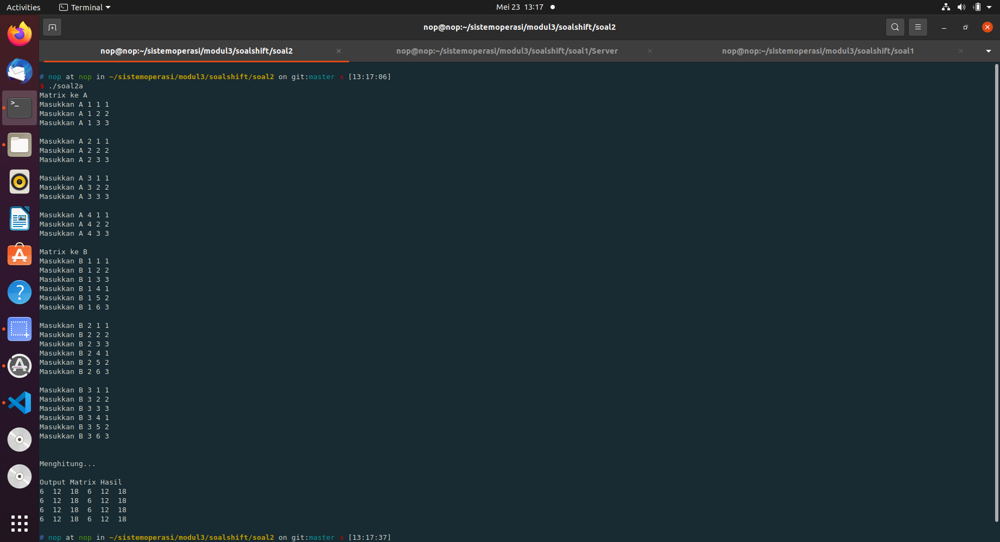

Soal 2 b

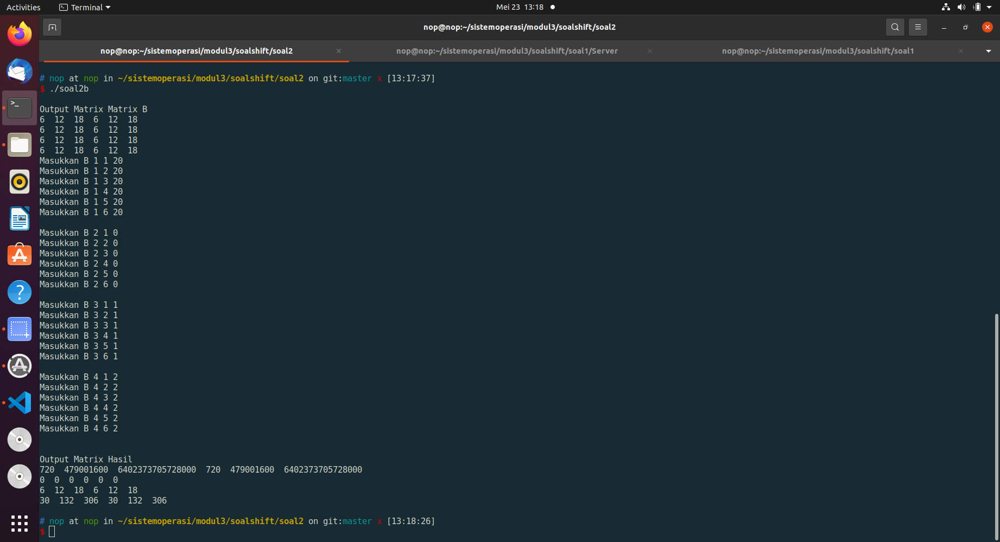

Soal 2 c


# Soal 3
### Deskripsi
Seorang mahasiswa bernama Alex sedang mengalami masa gabut. Di saat masa gabutnya, ia memikirkan untuk merapikan sejumlah file yang ada di laptopnya. Karena jumlah filenya terlalu banyak, Alex meminta saran ke Ayub. Ayub menyarankan untuk membuat sebuah program C agar file-file dapat dikategorikan. Program ini akan memindahkan file sesuai ekstensinya ke dalam folder sesuai ekstensinya yang folder hasilnya terdapat di working directory ketika program kategori tersebut dijalankan.

Contoh apabila program dijalankan:
```
# Program soal3 terletak di /home/izone/soal3
$ ./soal3 -f path/to/file1.jpg path/to/file2.c path/to/file3.zip
#Hasilnya adalah sebagai berikut
/home/izone
|-jpg
|--file1.jpg
|-c
|--file2.c
|-zip
|--file3.zip
```
## Soal 3.a
### Deskripsi
Program menerima opsi -f seperti contoh di atas, jadi pengguna bisa menambahkan argumen file yang bisa dikategorikan sebanyak yang diinginkan oleh pengguna. 
Output yang dikeluarkan adalah seperti ini :
```
File 1 : Berhasil Dikategorikan (jika berhasil)
File 2 : Sad, gagal :( (jika gagal)
File 3 : Berhasil Dikategorikan
```
### Penyelesaian
Hal yang pertama dilakukan adalah menangkap argumen ketika program dijalankan. Setelah itu membandingkan dengan strcmp untuk mode yang dipilih dalam mengkategorikan file.
```
int main(int argc, char const *argv[])
{
  if (argc == 1)
  {
    exit(1);
  }

  pthread_t tid[100];
  //  Jika mode -f
  if (strcmp(argv[1], "-f") == 0)
  {
    ...
  }
  else if (strcmp(argv[1], "-d") == 0)
  {
    ...
  }
  else if (strcmp(argv[1], "*") == 0)
  {
    ...
  }
}
```
Disini juga terdapat fungsi penting yang akan digunakan diseluruh mode yaitu ```routeF()```. Pada fungsi ini akan menerima fullpath dari file yang akan dikategorikan. Dari fullpath tersebut akan dipisahkan ke beberapa array untuk mempermudah mengkategorikannya. Kita menggunakan strtok untuk melakukan split. Pertama kita akan mendapatkan nama file nya tengan melakukan split ```\``` sampai habis dan diambil untuk dimasukkan ke array filename. Setelah itu kita akan mendapatkan ekstensi file untuk nama folder kategori dengan cara strtok juga sampai habis dengan delimiter ```.```. Membuat direktori sesuai ekstensi tersebut dan melakukan rename atau memindahkan file dari path awal ke path yang sudah dikategorikan. Fungsi ini akan digunakan di 3 metode yang ada.
```
void *routeF(void *arg)
{
  coba++;
  char fromfilenmamepath[500], filename[500], ekstensi[500];
  char tofilenamepath[500], pwd[500];
  char temp[500];
  char *temp2[500];
  char *temp3[500];
  char *slash, *dot;

  // Mendapatkan fullpath
  strcpy(fromfilenmamepath, (char *)arg);

  // Mendapatkan nama file
  int x = 0;
  strcpy(temp, fromfilenmamepath);
  slash = strtok(temp, "/");
  while (slash != NULL)
  {
    temp2[x] = slash;
    x++;
    slash = strtok(NULL, "/");
  }

  strcpy(filename, temp2[x - 1]);
  if (access(fromfilenmamepath, F_OK) != -1)
  {
    DIR *dir = opendir(fromfilenmamepath);
    if (dir)
    {
      closedir(dir);
      if (strcmp(pilihanMode, "-f") == 0)
      {
        char message[1024];
        sprintf(message, "%s : Sad, gagal\n", filename);
        printf("%s", message);
      }
      check = 0;
    }
    else
    {
      closedir(dir);
      if (strchr(filename, '.') != NULL)
      {

        dot = strtok(temp2[x - 1], ".");
        int y = 0;
        while (dot != NULL)
        {
          temp3[y] = dot;
          y++;
          dot = strtok(NULL, "/");
        }
        strcpy(ekstensi, temp3[y - 1]);

        for (int i = 0; i < strlen(ekstensi); i++)
        {
          ekstensi[i] = tolower(ekstensi[i]);
        }
        if (y <= 1)
        {
          strcpy(ekstensi, "Hidden");
        }
      }
      else
      {
        strcpy(ekstensi, "Unknown");
      }

      // Mendapatkan current direktori
      char cwd[500];
      getcwd(cwd, sizeof(cwd));
      strcpy(tofilenamepath, cwd);
      strcat(tofilenamepath, "/");
      strcat(tofilenamepath, ekstensi);
      strcat(tofilenamepath, "/");
      strcat(tofilenamepath, filename);

      // ngecek guis
      // printf("%s -> ", fromfilenmamepath);
      // printf("%s\n", tofilenamepath);

      // Membuat direktori sesuai ekstensi

      DIR *dr2 = opendir(ekstensi);
      if (ENOENT == errno)
      {
        mkdir(ekstensi, 0775);
        closedir(dr2);
      }

      rename(fromfilenmamepath, tofilenamepath);
      char message[1000];
      if (strcmp(pilihanMode, "-f") == 0)
      {
        sprintf(message, "%s : Berhasil Dikategorikan\n", filename);
        printf("%s", message);
      }
    }
  }
  else
  {
    if (strcmp(pilihanMode, "-f") == 0)
    {
      char message[600];
      sprintf(message, "%s : Sad, gagal\n", filename);
      printf("%s", message);
    }
    check = 0;
  }
}

```
Tinggal kita panggil fungsi routeF() dengan pthread dan memasukkan nam file sebagai argumen.
```
  if (strcmp(argv[1], "-f") == 0)
  {
    pilihanMode = "-f";
    int i = 2;
    while (i < argc)
    {
      pthread_create(&(tid[i - 2]), NULL, routeF, (void *)argv[i]);
      i++;
    }
    i = 2;
    while (i < argc)
    {
      pthread_join(tid[i - 2], NULL);
      i++;
    }
  }
```
## Soal 3.b
### Deskripsi
Program juga dapat menerima opsi -d untuk melakukan pengkategorian pada suatu directory. Namun pada opsi -d ini, user hanya bisa memasukkan input 1 directory saja, tidak seperti file yang bebas menginput file sebanyak mungkin. Contohnya adalah seperti ini:
```
$ ./soal3 -d /path/to/directory/
```

Perintah di atas akan mengkategorikan file di /path/to/directory, lalu hasilnya akan disimpan di working directory dimana program C tersebut berjalan (hasil kategori filenya bukan di /path/to/directory).
Output yang dikeluarkan adalah seperti ini :
```
Jika berhasil, print “Direktori sukses disimpan!”
Jika gagal, print “Yah, gagal disimpan :(“
```
### Penyelesaian
Hampir sama dengan Penyelesaian 3b tetapi disini terdapat langkah awal yang harus dilakukan. Pertama kita memanggil fungsi yang bernama ```listdir()``` dan memasukkan path direktori ke argumen fungsi tersebut . Disini akan melakukan readdir() untuk mengetahui seluruh isi file dengan filepath yang lengkap dengan cara rekursif. Dimana seluruh list file tersebut akan dimaksukkan ke array yang bernama f_name. Kita melakukan write dengan cara ```sprintf()```

```
void listdir(const char *name)
{
  DIR *dir;
  struct dirent *entry;

  if (!(dir = opendir(name)))
  {
    check = 0;
    return;
  }
  else
  {
    while ((entry = readdir(dir)) != NULL)
    {
      if (entry->d_type == DT_DIR)
      {
        char path[2048];
        if (strcmp(entry->d_name, ".") == 0)
        {
          continue;
        }
        if (strcmp(entry->d_name, "..") == 0)
        {
          continue;
        }
        snprintf(path, sizeof(path), "%s/%s", name, entry->d_name);
        listdir(path);
      }
      else
      {
        sprintf(f_name + strlen(f_name), "%s/%s\n", name, entry->d_name);
      }
    }
    closedir(dir);
  }
}
```
setelah itu tinggal kita masukkan ke array filenamepath dengan melakukan strtok f_name dengan delimiter ```\n```. Terakhir tinggal memanggil ```routeF()``` dengan pthread untuk dikategorikan
```
  else if (strcmp(argv[1], "-d") == 0)
  {
    memset(f_name, 0, sizeof(f_name));
    listdir(argv[2]);
    pilihanMode = "-d";
    int index2 = 0;
    char *token = strtok(f_name, "\n");
    char **filenamepath = malloc(200 * sizeof(char *));
    while (token != NULL)
    {
      filenamepath[index2] = token;
      index2++;
      token = strtok(NULL, "\n");
    }

    int i = 0;
    while (i < index2)
    {
      pthread_create(&(tid[i]), NULL, routeF, (void *)filenamepath[i]);
      i++;
    }
    i = 0;
    while (i < index2)
    {
      pthread_join(tid[i], NULL);
      i++;
    }

    if (check == 1)
    {
      printf("Direktori sukses disimpan!");
    }
    else if (check == 0)
    {
      printf("Yah, gagal disimpan :(");
    }
  }
```
## Soal 3.c
### Deskripsi
Selain menerima opsi-opsi di atas, program ini menerima opsi *, contohnya ada di bawah ini:
```
$ ./soal3 \*
```

Opsi ini akan mengkategorikan seluruh file yang ada di working directory ketika menjalankan program C tersebut.
### Penyelesaian
Disini hampir sama kayak Penyelesaian 3b. Yang membedakan cuma diawal yaitu kita akan mengetahui current directory terlebih dahulu dengan menggunakan ```getcwd()``` Setelah itu direktori tersebut akan dimasukkan ke fungsi listdir() untuk diketahui seluruh isi file. Setelah itu tinggal memanggil routeF() dengan menggunakan pthread() untuk mengkategorikan file tersebut.
```
  else if (strcmp(argv[1], "*") == 0)
  {
    memset(f_name, 0, sizeof(f_name));
    char currentDirectory[1337];
    getcwd(currentDirectory, sizeof(currentDirectory));
    listdir(currentDirectory);
    pilihanMode = "*";
    int index3 = 0;
    char *token = strtok(f_name, "\n");
    char **filenamepath = malloc(200 * sizeof(char *));
    while (token != NULL)
    {
      filenamepath[index3] = token;
      index3++;
      token = strtok(NULL, "\n");
    }

    for (int i = 0; i < index3; i++)
    {
      pthread_create(&(tid[i]), NULL, routeF, (void *)filenamepath[i]);
    }

    for (int i = 0; i < index3; i++)
    {
      pthread_join(tid[i], NULL);
    }

    if (check == 1)
    {
      printf("sukses disimpan!");
    }
    else if (check == 0)
    {
      printf("Yah, ada yang gagal disimpan :(");
    }
  }
```
## Soal 3.d
### Deskripsi
Semua file harus berada di dalam folder, jika terdapat file yang tidak memiliki ekstensi, file disimpan dalam folder “Unknown”. Jika file hidden, masuk folder “Hidden”.
### Penyelesaian
Ini terdapat paad fungsi routeF(). Kita menggunakan strchr() untuk mengecek ada ```.``` apa tidak di nama file jika tidak ada maka ```Unknown```, Lalu jika ```.``` berada di depan maka jumlah count y <=1 maka ```Hidden```

```
if (strchr(filename, '.') != NULL)
{

  dot = strtok(temp2[x - 1], ".");
  int y = 0;
  while (dot != NULL)
  {
    temp3[y] = dot;
    y++;
    dot = strtok(NULL, "/");
  }
  strcpy(ekstensi, temp3[y - 1]);

  for (int i = 0; i < strlen(ekstensi); i++)
  {
    ekstensi[i] = tolower(ekstensi[i]);
  }
  if (y <= 1)
  {
    strcpy(ekstensi, "Hidden");
  }
}
else
{
  strcpy(ekstensi, "Unknown");
}
```
## Soal 3.e
### Deskripsi
Setiap 1 file yang dikategorikan dioperasikan oleh 1 thread agar bisa berjalan secara paralel sehingga proses kategori bisa berjalan lebih cepat.
### Penyelesaian
Dengan menggunakan pthread yang sudah dijelaskan pada penjelasan soal point sebelumnya.
## Kendala
Tidak ada
## Screenshot
Soal3 mode f

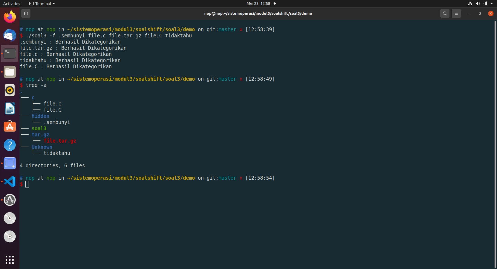

Soal3 mode d

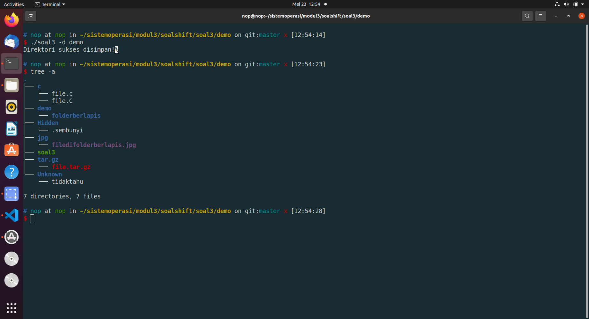

Soal3 mode *

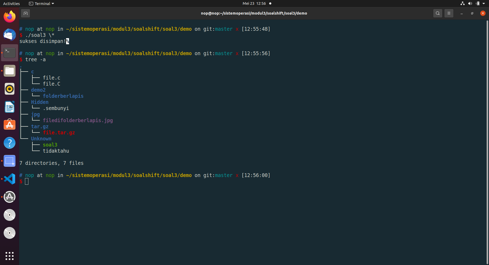
